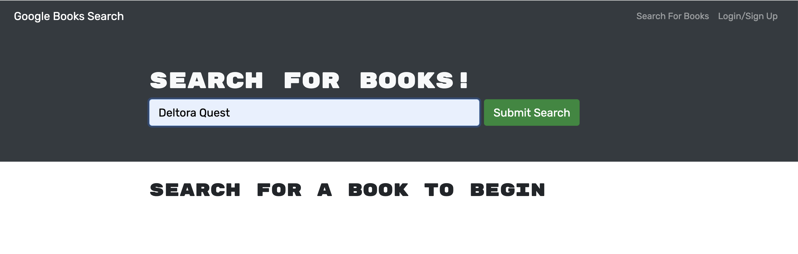
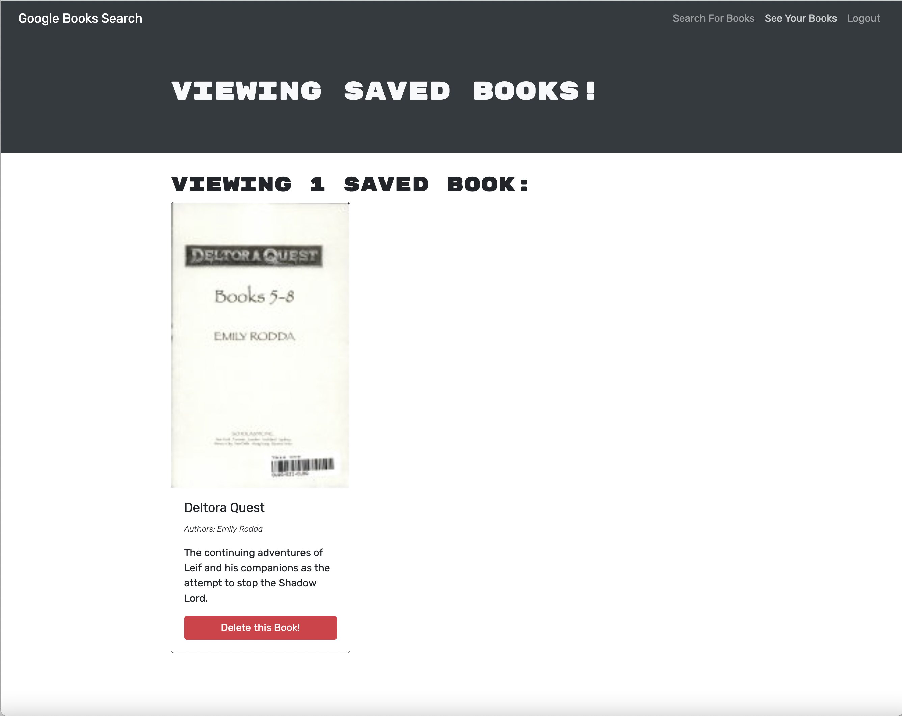

# <Googlebook-Search-Engine>

##  Googlebook Search Engine

 Most modern websites are driven by two things: data and user demands. This shouldn't come as a surprise, as the ability to personalize user data is the cornerstone of real-world web development today. And as user demands evolve, applications need to be more performant.

This website is fully functioning Google Books API search engine built with a RESTful API, and refactor it to be a GraphQL API built with Apollo Server. The app was built using the MERN stack with a React front end, MongoDB database, and Node.js/Express.js server and API. It's set up to allow users to save book searches to the back end. 


## Summery

```md
GIVEN a book search engine
WHEN I load the search engine
THEN I am presented with a menu with the options Search for Books and Login/Signup and an input field to search for books and a submit button
WHEN I click on the Search for Books menu option
THEN I am presented with an input field to search for books and a submit button
WHEN I am not logged in and enter a search term in the input field and click the submit button
THEN I am presented with several search results, each featuring a book’s title, author, description, image, and a link to that book on the Google Books site
WHEN I click on the Login/Signup menu option
THEN a modal appears on the screen with a toggle between the option to log in or sign up
WHEN the toggle is set to Signup
THEN I am presented with three inputs for a username, an email address, and a password, and a signup button
WHEN the toggle is set to Login
THEN I am presented with two inputs for an email address and a password and login button
WHEN I enter a valid email address and create a password and click on the signup button
THEN my user account is created and I am logged in to the site
WHEN I enter my account’s email address and password and click on the login button
THEN I the modal closes and I am logged in to the site
WHEN I am logged in to the site
THEN the menu options change to Search for Books, an option to see my saved books, and Logout
WHEN I am logged in and enter a search term in the input field and click the submit button
THEN I am presented with several search results, each featuring a book’s title, author, description, image, and a link to that book on the Google Books site and a button to save a book to my account
WHEN I click on the Save button on a book
THEN that book’s information is saved to my account
WHEN I click on the option to see my saved books
THEN I am presented with all of the books I have saved to my account, each featuring the book’s title, author, description, image, and a link to that book on the Google Books site and a button to remove a book from my account
WHEN I click on the Remove button on a book
THEN that book is deleted from my saved books list
WHEN I click on the Logout button
THEN I am logged out of the site and presented with a menu with the options Search for Books and Login/Signup and an input field to search for books and a submit button  
```

## User Story

```md
AS AN avid reader
I WANT to search for new books to read
SO THAT I can keep a list of books to purchase
```

## Mock-Up
Let's start by revisiting the web application's appearance and functionality.


[Walkthrough video](https://drive.google.com/file/d/1d53nWYfNCzpf3eMBEnyvXLkOXFlBjhcT/view)

Application is also Deployed to Heroku with a MongoDB database using MongoDB Atlas.
[Application deployed at live URL.](https://hp-googlebook-search-book.herokuapp.com/)

 Use the [Deploy with Heroku and MongoDB Atlas](https://coding-boot-camp.github.io/full-stack/mongodb/deploy-with-heroku-and-mongodb-atlas) walkthrough for instructions.


As you can see in the following screen shots, a user can type a search term in a search box and the results appear:



The user can save books by clicking "Save This Book!" under each search result if they login as shown in the following screen shots:


A user can view their saved book on a separate page, as shown in the following :



## Installation

To run the code in your server after cloning :
 ```md
npm i 
```
to run the server and client at the same time:
 ```md
npm run develop
```

## Key Topics

The following topics are coverd to make this website:

* [GraphQL Playground](https://www.apollographql.com/docs/apollo-server/testing/graphql-playground/)

* [GraphQL Query](https://graphql.org/learn/queries/)

* [Resolvers](https://www.apollographql.com/docs/tutorial/resolvers/)

* [Query parameters](https://graphql.org/graphql-js/passing-arguments/)

* [Mutations](https://www.apollographql.com/docs/react/data/mutations/)

* [useMutation Hook](https://www.apollographql.com/docs/tutorial/mutations/)

* [useQuery Hook](https://www.apollographql.com/docs/tutorial/queries/)

* [React Router](https://reactrouter.com/web/guides/quick-start)

* [JSON Web Tokens](https://jwt.io/introduction)

* [Authentication in GraphQL API](https://www.apollographql.com/docs/apollo-server/security/authentication/)

* [Git hooks](https://git-scm.com/book/en/v2/Customizing-Git-Git-Hooks)

To migrate to the latest version of Apollo Server, please refer to the [Apollo Server Docs on Migrating to Apollo Server 3](https://www.apollographql.com/docs/apollo-server/migration/#nodejs) and [Apollo Server Docs on Implementing Apollo Server Express with v3](https://www.apollographql.com/docs/apollo-server/integrations/middleware/#apollo-server-express). Note that if you are using Apollo Server 3 you are required use `await server.start()` before calling `server.applyMiddleware`.